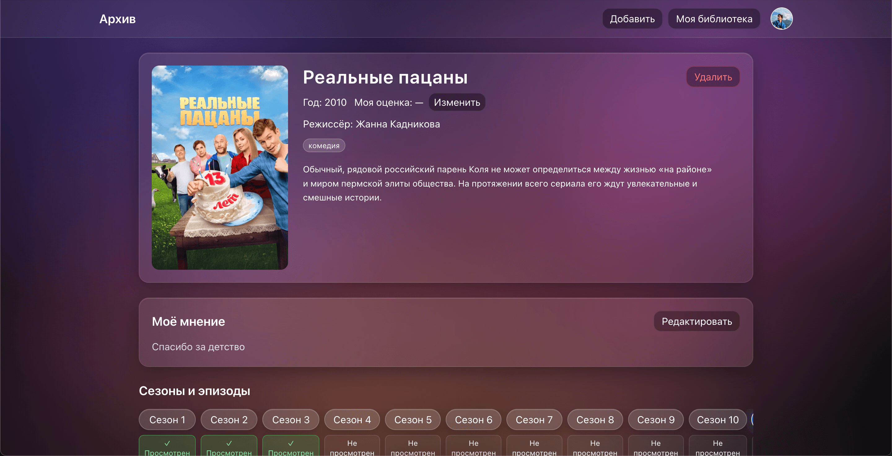
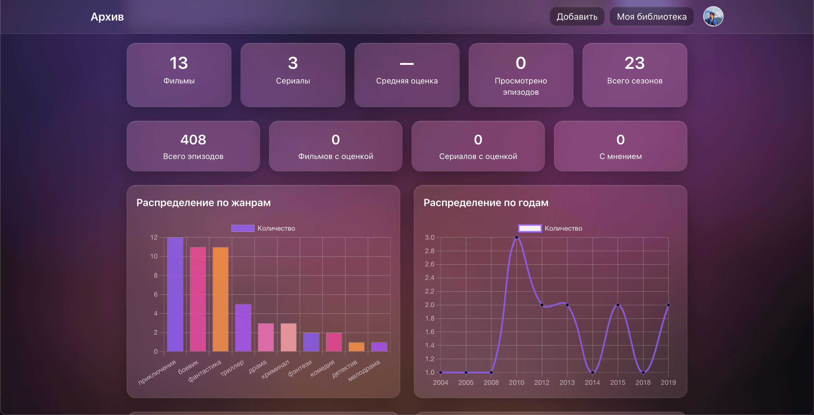

<div align="center">

# 🎬 Медиа-Архив

### Персональная библиотека фильмов и сериалов

[](https://archive.рф)
[](https://www.typescriptlang.org/)
[](https://reactjs.org/)
[](https://nodejs.org/)
[](https://www.postgresql.org/)

---

<a href="https://archive.рф" target="_blank">
  
</a>

---

</div>

## 📖 О проекте

**Медиа-Архив** — это современное веб-приложение для управления личной коллекцией фильмов и сериалов. Создано для удобного ведения собственного медиа-архива, отслеживания прогресса просмотра и анализа статистики.

### ✨ Ключевые возможности

- 🔐 **Безопасная аутентификация** — JWT с refresh токенами, HTTP-only cookies, защита от CSRF
- 🎬 **Управление библиотекой** — добавление фильмов и сериалов с кастомными рейтингами и заметками
- 📺 **Отслеживание прогресса** — отметка просмотренных сезонов и эпизодов
- 📊 **Детальная статистика** — анализ по жанрам, рейтингам, динамика просмотров, графики
- 🔌 **Интеграция с Кинопоиском** — автоматическое заполнение данных о фильмах
- 🎨 **Современный UI** — красивый интерфейс с поддержкой концепт-артов и постеров
- 🧪 **Тестирование** — покрытие ключевых сценариев unit и integration тестами
- 🐳 **Docker-ready** — полная контейнеризация, готовность к CI/CD

## 🛠 Технологии

### Backend

- **Node.js** + **Express** + **TypeScript**
- **PostgreSQL** с миграциями
- **JWT** аутентификация (access + refresh tokens)
- **Rate limiting**, **CSRF защита**, **Security logging**
- **Prometheus** метрики для мониторинга

### Frontend

- **React** + **TypeScript** + **Vite**
- **React Router** для навигации
- **Tailwind CSS** для стилизации
- **React Hot Toast** для уведомлений
- **Markdown** редактор для заметок

### DevOps

- **Docker** + **Docker Compose**
- **GitHub Actions** для CI/CD
- **Nginx** для reverse proxy
- **Prometheus** + **Grafana** для мониторинга

## 🚀 Быстрый старт

### Предварительные требования

- Node.js 18+ и npm
- Docker и Docker Compose (опционально)
- PostgreSQL 16+ (если запускаете без Docker)

### Установка

```bash
# Клонируйте репозиторий
git clone <repo-url>
cd media-archive

# Установите зависимости
npm install

# Запуск через Docker (рекомендуется)
docker compose -f docker-compose.dev.yml up -d

# Или локально
npm run dev --workspace server  # Сервер на http://localhost:4000
npm run dev --workspace client  # Клиент на http://localhost:5173
```

### Настройка переменных окружения

Создайте файл `.env` в корне проекта:

```bash
# Сервер
PORT=4000
NODE_ENV=development
API_BASE_URL=http://localhost:4000
FRONTEND_URL=http://localhost:5173

# База данных
PGHOST=localhost
PGPORT=5432
PGUSER=postgres
PGPASSWORD=postgres
PGDATABASE=media_archive

# JWT
JWT_SECRET=dev-access-secret-change-me
JWT_REFRESH_SECRET=dev-refresh-secret-change-me
ACCESS_TOKEN_TTL_MINUTES=15
REFRESH_TOKEN_TTL_DAYS=30

# Интеграции
KINOPOISK_API_KEY=<ваш_ключ>
GOOGLE_CLIENT_ID=<ваш_client_id>
GOOGLE_CLIENT_SECRET=<ваш_client_secret>

# SMTP (для email подтверждения)
SMTP_HOST=smtp.gmail.com
SMTP_PORT=587
SMTP_SECURE=false
SMTP_USER=ваш_email@gmail.com
SMTP_PASSWORD=пароль_приложения
SMTP_FROM=ваш_email@gmail.com
```

> 📚 Подробные инструкции по настройке SMTP и других сервисов находятся в папке [`docs/`](docs/)

## 📸 Скриншоты

<div align="center">

|           Главная страница            |           Карточка фильма            |                Статистика                 |
| :-----------------------------------: | :----------------------------------: | :---------------------------------------: |
|  |  |  |

</div>

## 📁 Структура проекта

```
media-archive/
├── client/          # React приложение
│   ├── src/
│   │   ├── components/    # React компоненты
│   │   ├── pages/         # Страницы приложения
│   │   ├── hooks/         # Custom hooks
│   │   ├── lib/           # Утилиты и API
│   │   └── routes/         # Роутинг
│   └── package.json
├── server/          # Express API
│   ├── src/
│   │   ├── app/           # Контроллеры, роуты, middlewares
│   │   ├── application/   # Бизнес-логика
│   │   ├── domain/         # Доменные модели
│   │   ├── infrastructure/ # Внешние сервисы
│   │   └── db/            # Миграции
│   └── package.json
├── docs/            # Документация
├── docker-compose.yml
└── README.md
```

## 🔧 Развертывание

### Продакшн

```bash
docker compose -f docker-compose.prod.yml up -d --build
```

Подробная инструкция по развертыванию на VPS находится в файле [`DEPLOY.md`](DEPLOY.md).

### CI/CD

Проект настроен для автоматического развертывания через GitHub Actions. При пуше в `main` ветку:

- Запускаются линтеры и тесты
- Собирается production build
- Выполняются миграции базы данных

## 📚 Документация

- [Настройка SMTP](docs/SMTP_SETUP.md) — настройка email подтверждения
- [Развертывание](DEPLOY.md) — инструкция по деплою на VPS
- [CI/CD настройка](docs/CI_CD_SETUP.md) — автоматизация развертывания
- [Интеграция с YouTube](docs/YOUTUBE_INTEGRATION.md) — работа с YouTube API
- [Telegram интеграция](docs/TELEGRAM_INTEGRATION.md) — уведомления в Telegram

## 🤝 Вклад в проект

Проект создан для личного использования, но если у вас есть идеи или предложения — создавайте issues!

## 📄 Лицензия

Этот проект создан для личного использования.

---

<div align="center">

**Создано с ❤️ для управления медиа-коллекцией**

[🌐 Попробовать сайт →](https://archive.рф)

</div>
